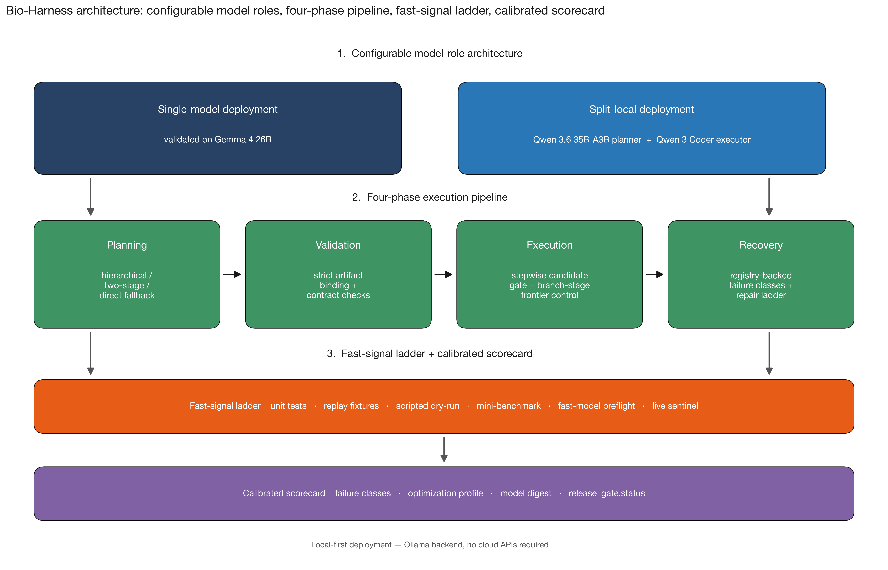

<p align="center">
  
</p>

<h1 align="center">Bio-Harness</h1>

<p align="center">
  <strong>Local-first autonomous bioinformatics agent</strong><br>
  Plan and execute multi-step scientific workflows with open-source LLMs. No cloud API required.
</p>

<p align="center">
  <a href="#quick-start"></a>&nbsp;
  <a href="#examples"></a>&nbsp;
  <a href="https://zenodo.org/records/20277620"></a>&nbsp;
  <a href="docs/benchmark_evidence.md"></a>&nbsp;
  <a href="LICENSE"></a>
</p>

---

## Manuscript

The manuscript publication record is available on Zenodo:
[zenodo.org/records/20277620](https://zenodo.org/records/20277620).

A repository-rendered manuscript copy is also available here:
[Read the manuscript](docs/manuscript/).

---

## What is Bio-Harness?

Bio-Harness is an **autonomous agent** that builds and runs complete bioinformatics pipelines from a plain-English description of your analysis goal. You describe what you want to analyze; it plans the pipeline, configures the tools, executes every step, and delivers the results.

Everything runs **locally on your machine** using open-source models through [Ollama](https://ollama.com). Your genomic data never leaves your computer.

**Key capabilities:**

- Plans multi-step workflows from natural-language prompts
- Executes 80+ real bioinformatics tools through typed wrappers with audited shell boundaries
- 11 domain-specific template compilers that catch hallucinated parameters, wrong defaults, and format mismatches before execution
- Strict artifact binding ensures every file path is real and every tool input exists
- Fails closed on errors (no silent wrong-answer completions)
- Converts every failure into a durable regression test so fixes never regress
- Web UI with setup wizard, live execution tracking, and terminal output

<details>
<summary><strong>How is this different from ChatGPT / Claude / other LLM tools?</strong></summary>

| | Cloud LLM chat | Bio-Harness |
|---|---|---|
| **Data privacy** | Data sent to external servers | Everything runs locally |
| **Tool execution** | Suggests commands for you to run | Executes real tools autonomously |
| **Parameter correctness** | Hallucinated defaults (e.g., ploidy=2 for bacteria) | Template compilers enforce domain-correct defaults |
| **Failure handling** | Silent wrong-answer completions | Fails closed; no scientifically meaningless output |
| **Reproducibility** | Single-shot, no regression tracking | Every failure becomes a replay fixture |
| **Cost** | Per-token billing, unpredictable for agentic loops | Free after hardware investment |
</details>

---

## Benchmark Results

Bio-Harness has been validated across **168 case-runs with a 100% pass rate**, zero automatic repairs, zero fallbacks, and zero fail-open events.

<p align="center">
  
</p>

| Sweep | Model configuration | Cases | Result |
|---|---|---|---|
| Qwen split-local (x4) | Qwen 3.6 35B planner + Qwen Coder executor | 4 x 24 | **96/96** |
| Gemma single-model (x2) | Gemma 4 26B | 2 x 24 | **48/48** |
| Qwen Coder deployment | Qwen Coder (single model) | 24 | **24/24** |
| **Total** | | | **168/168** |

### Supported analysis types

| Band | Analysis types |
|---|---|
| **Core (Band 1)** | Bacterial evolution variant calling, RNA-seq differential expression, Transcript quantification |
| **Extended (Band 2)** | Germline variant calling (GIAB), Phylogenetics, Single-cell RNA-seq, Variant annotation, Viral metagenomics, Metagenomics classification |
| **Advanced (Band 3)** | Alzheimer mouse DGE/pathway, Cystic fibrosis clinical variant |

---

## Quick Start

> **Requirements:** Python 3.10+, macOS or Linux, 16 GB+ RAM recommended

### Option A: One-click macOS launcher

Double-click the file in the repo root:

```
Launch Bio-Harness.command
```

This handles Python/Pixi environment setup, web UI installation, local server
startup, and opens the setup wizard in your browser. From the wizard, you can
start Ollama, choose a tested model, download it with progress, and run the mini
preflight. Keep the terminal window open while using Bio-Harness.

> **Tip:** If macOS warns the file is from the internet, right-click it and choose **Open**.

### Option B: Command-line setup

**1. Clone and bootstrap**

```bash
git clone https://github.com/jared-richardson/BioHarness.git
cd BioHarness
python3 scripts/bootstrap_bioharness.py
```

The bootstrap creates a virtual environment, installs dependencies, sets up the Pixi tool environment, and writes a setup report.

**2. Install Ollama and pull a model**

```bash
# Install Ollama from https://ollama.com, then:
ollama serve
```

```bash
# Pull the recommended model (~15 GB)
ollama pull qwen3-coder-next:latest
```

**3. Run the first-run setup check**

```bash
python3 scripts/first_run_setup.py
```

This verifies Python, Pixi, Ollama, model availability, disk space, and RAM. It writes a receipt to `workspace/setup_reports/`.

**4. Launch the UI**

```bash
# Terminal 1: Start the API backend
.venv/bin/python ui_v2_api.py

# Terminal 2: Start the React frontend
cd apps/web && npm ci && npm run dev
```

Open **http://localhost:5173** in your browser. If setup is incomplete, the UI opens the setup wizard automatically.

For a custom local frontend port, set both the frontend API target and the
backend's allowed browser origin:

```bash
# Terminal 1
BIO_HARNESS_UI_CORS_ORIGINS=http://127.0.0.1:15173,http://localhost:15173 .venv/bin/python ui_v2_api.py

# Terminal 2
cd apps/web
VITE_API_BASE=http://127.0.0.1:8000 npm run dev -- --host 127.0.0.1 --port 15173
```

### Option C: CLI only (no UI)

```bash
pixi run python scripts/run_agent_e2e.py \
  --prompt "Your analysis goal here" \
  --data-root /path/to/your/data \
  --selected-dir workspace \
  --print-plan
```

---

## Validated Model Paths

Bio-Harness supports configurable model-role deployment. Three paths have been validated with full 24-case sweeps:

| Path | Model(s) | Download size | RAM needed | Best for |
|---|---|---|---|---|
| **Recommended** | `qwen3-coder-next:latest` | ~15 GB | ~20 GB | Most users. One model does everything. |
| Gemma alternative | `gemma4:26b` | ~16 GB | ~20 GB | Users who prefer Google models. |
| Advanced split | `qwen3.6:35b-a3b` + `qwen3-coder-next:latest` | ~25 GB total | ~28 GB | Research. Separate planner/executor. |

```bash
# Recommended: single-model Qwen Coder
ollama pull qwen3-coder-next:latest

# Alternative: Gemma
ollama pull gemma4:26b

# Advanced: split-local (two models)
ollama pull qwen3.6:35b-a3b
ollama pull qwen3-coder-next:latest
```

### Setting the model

By default, Bio-Harness uses the recommended single-model path. For alternative configurations:

```bash
# Single-model Gemma
export BIO_HARNESS_MODEL=gemma4:26b

# Split-local (advanced)
export BIO_HARNESS_MODEL=qwen3-coder-next:latest
export BIO_HARNESS_MODEL_HEAVY=qwen3.6:35b-a3b
```

---

## Examples

### RNA-seq differential expression

```bash
# Stage your FASTQ files
python3 scripts/stage_inputs.py /path/to/treatment_R1.fastq.gz
python3 scripts/stage_inputs.py /path/to/treatment_R2.fastq.gz
python3 scripts/stage_inputs.py /path/to/control_R1.fastq.gz
python3 scripts/stage_inputs.py /path/to/control_R2.fastq.gz

# Run the analysis
pixi run python scripts/run_agent_e2e.py \
  --prompt "Run RNA-seq differential expression analysis on the staged inputs. \
            Use STAR for alignment, featureCounts for quantification, and DESeq2 \
            for differential expression testing." \
  --data-root workspace/inputs_readonly \
  --selected-dir workspace \
  --print-plan
```

### Bacterial variant calling

```bash
pixi run python scripts/run_agent_e2e.py \
  --prompt "Call variants in evolved bacterial samples relative to the ancestor. \
            Identify shared mutations across evolved lineages." \
  --data-root /path/to/evolution/data \
  --selected-dir workspace \
  --print-plan
```

### Germline variant calling (GIAB)

```bash
pixi run python scripts/run_agent_e2e.py \
  --prompt "Perform germline variant calling on the sample reads against the \
            reference genome. Filter for high-confidence variants." \
  --data-root /path/to/germline/data \
  --selected-dir workspace \
  --print-plan
```

### Single-cell RNA-seq

```bash
pixi run python scripts/run_agent_e2e.py \
  --prompt "Run single-cell RNA-seq analysis: normalize, cluster, and identify \
            marker genes for each cluster." \
  --data-root /path/to/singlecell/data \
  --selected-dir workspace \
  --print-plan
```

### Metagenomics classification

```bash
pixi run python scripts/run_agent_e2e.py \
  --prompt "Classify metagenomic reads using Kraken2 and identify the dominant \
            genera in the sample." \
  --data-root /path/to/metagenomics/data \
  --selected-dir workspace \
  --print-plan
```

### Phylogenetics

```bash
pixi run python scripts/run_agent_e2e.py \
  --prompt "Build a phylogenetic tree from the provided sequences using \
            multiple sequence alignment and maximum-likelihood inference." \
  --data-root /path/to/sequences \
  --selected-dir workspace \
  --print-plan
```

<details>
<summary><strong>More examples: variant annotation, viral metagenomics, pathway analysis</strong></summary>

### Variant annotation

```bash
pixi run python scripts/run_agent_e2e.py \
  --prompt "Annotate variants in the VCF file with functional impact predictions \
            using SnpEff and filter for high-impact variants." \
  --data-root /path/to/variants \
  --selected-dir workspace \
  --print-plan
```

### Viral metagenomics

```bash
pixi run python scripts/run_agent_e2e.py \
  --prompt "Assemble viral contigs from the metagenomic reads, classify them, \
            and identify the dominant viral families." \
  --data-root /path/to/viral/data \
  --selected-dir workspace \
  --print-plan
```

### Alzheimer mouse DGE + pathway analysis

```bash
pixi run python scripts/run_agent_e2e.py \
  --prompt "Run differential gene expression analysis between Alzheimer model \
            and wild-type mice. Perform pathway enrichment to identify affected \
            KEGG pathways." \
  --data-root /path/to/mouse/data \
  --selected-dir workspace \
  --print-plan
```

### Cystic fibrosis clinical variant identification

```bash
pixi run python scripts/run_agent_e2e.py \
  --prompt "Identify the causal variant for cystic fibrosis from the patient \
            VCF. Cross-reference with ClinVar for clinical significance." \
  --data-root /path/to/cf/data \
  --selected-dir workspace \
  --print-plan
```

</details>

---

## Architecture

<p align="center">
  
</p>

Bio-Harness uses a **template-compiler hybrid planning** architecture:

1. **LLM planning** -- The local model drafts a multi-step workflow from your prompt
2. **Template compilation** -- 11 domain-specific compilers patch the plan with correct parameters, tool ordering, and format specifications
3. **Strict artifact binding** -- Every file path in the plan is validated against real files on disk before execution begins
4. **Execution** -- Tools run through typed wrappers with audited shell boundaries
5. **Recovery** -- If a step fails, the system attempts artifact-aware pivoting, tool substitution, and checkpoint-aware resume
6. **Scorecard** -- Every event is recorded with model digest, configuration, and failure-class label

### Template compilers

The compilers are the key to reliability. When the LLM plans a bacterial variant-calling pipeline and sets ploidy=2 (a common hallucination -- it's the human default, not bacterial), the template compiler catches it and patches it to ploidy=1 before execution starts.

| Analysis type | Compiler | What it enforces |
|---|---|---|
| Bacterial evolution | `_compile_bacterial_evolution_shared_plan()` | Ploidy, branch routing, ancestor subtraction |
| RNA-seq DE | `_compile_rna_seq_de_plan()` | STAR index, strand-specificity, DESeq2 setup |
| Transcript quantification | `_compile_transcript_quant_plan()` | Salmon index, library type, quantification mode |
| Metagenomics | `_compile_metagenomics_plan()` | Kraken2 DB, assembly mode, classification flow |
| Single-cell RNA-seq | `_compile_single_cell_plan()` | Normalization, clustering, marker detection |
| Germline variant calling | `_compile_germline_variant_calling_plan()` | GIAB standards, ploidy, filtering thresholds |
| Variant annotation | `_compile_variant_annotation_plan()` | SnpEff DB, impact classification, filtering |
| Comparative genomics | `_compile_comparative_genomics_plan()` | BLAST parameters, alignment format |
| Viral metagenomics | `_compile_viral_metagenomics_plan()` | Assembly, classification, contig filtering |
| Multi-model DGE/pathway | `_compile_multi_model_dge_plan()` | Statistical testing, enrichment, pathway DBs |
| Phylogenetics | `_compile_phylogenetics_plan()` | MSA, model selection, tree inference |

---

## Fast-Signal Regression Methodology

Bio-Harness includes a calibrated fast-signal regression system that converts every live failure into a durable test artifact. Instead of trusting single-run pass/fail, the system maintains reproduction-rate context for every test.

<p align="center">
  
</p>

### The six-tier ladder

| Tier | What it tests | Speed | Command |
|---|---|---|---|
| **1. Unit tests** | Core contracts, parsers, binders | Seconds | `pytest tests/` |
| **2. Replay fixtures** | 38 curated planner + gate fixtures | Seconds | `python3 scripts/replay_fast_signal_fixtures.py` |
| **3. Mini-benchmarks** | 3 real-tool cases with tiny synthetic data | Minutes | `python3 scripts/run_fast_model_preflight.py --suite mini ...` |
| **4. Prompt probes** | 40 paired sensitivity trials | Minutes | `python3 scripts/run_fast_signal_prompt_probe.py ...` |
| **5. Full sweeps** | 24-case variant sweeps | Hours | `python3 scripts/run_bioagentbench_official.py ...` |
| **6. Scorecard** | 131-row calibrated release gate | Continuous | `python3 scripts/fast_signal_scorecard.py ...` |

<p align="center">
  
</p>

Run the replay fixtures as a quick sanity check after any code change:

```bash
python3 scripts/replay_fast_signal_fixtures.py tests/fixtures/fast_signal
```

---

## Project Structure

```
BioHarness/
  apps/
    web/                     # React/Vite UI (primary interface)
    streamlit/               # Streamlit UI (compatibility fallback)
  bio_harness/
    core/                    # Planning, contracts, artifact binding, recovery
    harness/                 # Execution engine, path utils, plan repair
    pipeline_scripts/        # 80+ typed tool wrappers (BWA, STAR, DESeq2, ...)
    skills/definitions/      # 85 skill specifications with typed schemas
    tools/                   # Tool registry and onboarding
    capabilities/            # Capability catalog and scientific tool index
    workflows/               # Workflow definitions
  scripts/
    bootstrap_bioharness.py  # Environment setup
    first_run_setup.py       # First-run assistant
    doctor_bioharness.py     # Dependency checker
    run_agent_e2e.py         # Main CLI entry point
    stage_inputs.py          # Stage user data into workspace
    setup_llm_backend.py     # Model setup and diagnostics
    replay_fast_signal_fixtures.py  # Run regression fixtures
    ...                      # 100+ scripts for benchmarks, validation, reporting
  tests/
    core/                    # Core unit tests
    fixtures/fast_signal/    # 38 curated replay fixtures
    pipeline_scripts/        # Tool wrapper tests
    skills/                  # Skill tests
  benchmark_data/            # Manifests and mini-benchmark generators
  docker/                    # Container recipes for isolated tools
  docs/                      # Full documentation
  ui_v2_api.py               # FastAPI backend for the React UI
  pixi.toml                  # Bioinformatics tool dependencies (conda-forge/bioconda)
  pyproject.toml             # Python package definition
```

---

## Included Bioinformatics Tools

Bio-Harness manages a comprehensive suite of bioinformatics tools through [Pixi](https://pixi.sh) (conda-forge + bioconda channels). Tools are installed into isolated environments and automatically added to the agent's PATH.

<details>
<summary><strong>Core tools (installed by default)</strong></summary>

| Category | Tools |
|---|---|
| **Alignment** | BWA-MEM2, STAR, Minimap2, Salmon |
| **Variant calling** | BCFtools, GATK4, VarScan |
| **Quantification** | Subread (featureCounts) |
| **Quality control** | FastQC, fastp, Cutadapt |
| **Assembly** | SPAdes |
| **Annotation** | SnpEff, SnpSift, Prodigal, BLAST+ |
| **Metagenomics** | Kraken2, Bracken |
| **Phylogenetics** | IQ-TREE, MAFFT |
| **Utilities** | SAMtools, BEDtools |
| **Single-cell** | Scanpy, Leidenalg |
| **Statistics** | PyDESeq2, GSEApy |

</details>

<details>
<summary><strong>Optional tool environments</strong></summary>

Install with `python3 scripts/bootstrap_bioharness.py --all-installable-tools` or individually:

| Environment | Tools | Install |
|---|---|---|
| `alignment-extra` | Bowtie2, HISAT2, Kallisto, StringTie | `pixi install -e alignment-extra` |
| `variant-extra` | FreeBayes | `pixi install -e variant-extra` |
| `r-bulk` | edgeR, limma | `pixi install -e r-bulk` |
| `r-splicing` | DEXSeq | `pixi install -e r-splicing` |
| `r-singlecell` | Seurat | `pixi install -e r-singlecell` |
| `specialty-general` | HMMER, MACS2, Bismark | `pixi install -e specialty-general` |
| `specialty-assembly` | Trinity | `pixi install -e specialty-assembly` |
| `specialty-annotation` | Ensembl VEP | `pixi install -e specialty-annotation` |
| `reports` | MultiQC, Quarto | `pixi install -e reports` |

</details>

---

## Environment Variables

| Variable | Default | Description |
|---|---|---|
| `BIO_HARNESS_MODEL` | `qwen3-coder-next:latest` | Primary model (executor, and planner if no heavy model set) |
| `BIO_HARNESS_MODEL_HEAVY` | Same as `BIO_HARNESS_MODEL` | Heavy model for planning (split-local mode) |
| `BIO_HARNESS_LLM_TIMEOUT_SECONDS` | `900` | Per-request LLM timeout |
| `BIO_HARNESS_LLM_THINK` | `false` | Enable thinking/reasoning mode |
| `BIO_HARNESS_PLANNER_TEMPLATE_FASTPATH` | `0` | Template bypass (advanced) |
| `BIO_HARNESS_UI_HOST` | `127.0.0.1` | API bind address (use `0.0.0.0` for LAN, trusted networks only) |
| `BIO_HARNESS_UI_PORT` | `8000` | API port |
| `BIO_HARNESS_UI_CORS_ORIGINS` | | Comma-separated allowed CORS origins for LAN UI access |
| `BIO_HARNESS_UI_CORS_ORIGIN_REGEX` | Localhost/127.0.0.1 HTTP ports | Optional regex for local browser origins; set empty to disable |
| `VITE_API_BASE` | `http://127.0.0.1:8000` | Frontend API target (for non-default backend) |

---

## Diagnostic Tools

Bio-Harness includes several diagnostic scripts to help troubleshoot setup and runtime issues:

```bash
# Full environment health check
python3 scripts/doctor_bioharness.py

# Check LLM backend status and model availability
python3 scripts/check_llm_backend.py

# Check system resources (disk, RAM, CPU)
python3 scripts/check_resource_preflight.py

# Show all harness capabilities
python3 scripts/show_harness_help.py --compact

# Verify STAR genome index setup
python3 scripts/check_star_setup.py
```

---

## Development

### Running tests

```bash
# Core unit tests
python3 -m pytest tests/ -q

# Replay fast-signal regression fixtures
python3 scripts/replay_fast_signal_fixtures.py tests/fixtures/fast_signal

# Public release tree checks
python3 scripts/scan_public_release_tree.py --root .
```

### Building the package

```bash
python3 -m pip install build
python3 -m build --sdist --wheel --outdir dist
```

### Web UI development

```bash
cd apps/web
npm ci
npm run lint
npm run build
npm audit --audit-level=moderate
```

### CI

The repository includes two GitHub Actions workflows:

- **Public CI** (on push/PR): runs release-gate tests, scans the public tree, builds the wheel, and checks the web UI
- **Package Smoke** (weekly): builds and installs the wheel, verifies console scripts and package data, replays fast-signal fixtures

---

## Frequently Asked Questions

<details>
<summary><strong>What hardware do I need?</strong></summary>

- **Minimum:** 16 GB RAM, 30 GB free disk (for model + tools)
- **Recommended:** 32 GB RAM, Apple Silicon Mac or Linux with a modern CPU
- **GPU:** Not required. Ollama uses CPU by default. GPU acceleration (CUDA/Metal) speeds up inference but is optional.

Bio-Harness is designed for local-first execution on researcher workstations, not cloud servers.
</details>

<details>
<summary><strong>Can I use my own model?</strong></summary>

Yes. Set `BIO_HARNESS_MODEL` to any Ollama-compatible model. The validated paths listed above have been tested across full 24-case sweeps, but any instruction-following model should work for basic tasks. Smaller models may produce more planning errors that require recovery.

Other supported backends: `ollama_openai`, `openai_compatible`, `vllm`, `mlx`.
</details>

<details>
<summary><strong>Can I use cloud models (GPT-4, Claude, etc.)?</strong></summary>

Bio-Harness supports OpenAI-compatible API backends via `BIO_HARNESS_LLM_BACKEND=openai_compatible`. However, this sends your prompts (and potentially data context) to external servers. The core value proposition of Bio-Harness is local-first execution with no data leaving your machine.
</details>

<details>
<summary><strong>What if a pipeline step fails?</strong></summary>

Bio-Harness has a multi-layer recovery system:

1. **Artifact-aware pivoting:** If an expected output is missing, the system checks for alternative valid outputs
2. **Tool substitution:** If a tool fails, the system can substitute an equivalent tool (e.g., BWA for Minimap2)
3. **Checkpoint-aware resume:** Long pipelines can resume from the last successful step
4. **Fail closed:** If recovery fails, the system stops and reports exactly what went wrong rather than producing silently wrong output
</details>

<details>
<summary><strong>How do I add my own data?</strong></summary>

Use the staging helper to symlink or copy your files into the workspace:

```bash
python3 scripts/stage_inputs.py /path/to/your/file.fastq.gz
```

Files are staged into `workspace/inputs_readonly/` where the agent can find them. The original files are not modified.
</details>

<details>
<summary><strong>Is this ready for production use?</strong></summary>

Bio-Harness is research software in active development (v0.1.0). It has been rigorously validated across 168 case-runs, but it is not yet a stable production release. Use it for research, exploration, and pipeline prototyping. Always verify scientific results through standard peer-review practices.
</details>

---

## Citation

If you use Bio-Harness in your research, please cite:

```bibtex
@software{richardson2026bioharness,
  title     = {Bio-Harness: Reliable Local-First Bioinformatics Agents
               with a Calibrated Fast-Signal Methodology},
  author    = {Richardson, Jared},
  year      = {2026},
  url       = {https://github.com/jared-richardson/BioHarness},
  version   = {0.1.0},
  license   = {MIT}
}
```

A `CITATION.cff` file is included in the repository for automatic citation tools.

---

## Contributing

See [CONTRIBUTING.md](CONTRIBUTING.md) for development setup, coding standards, and pull request expectations.

## Security

See [SECURITY.md](SECURITY.md) for the security policy and responsible disclosure process.

## License

MIT -- see [LICENSE](LICENSE).
