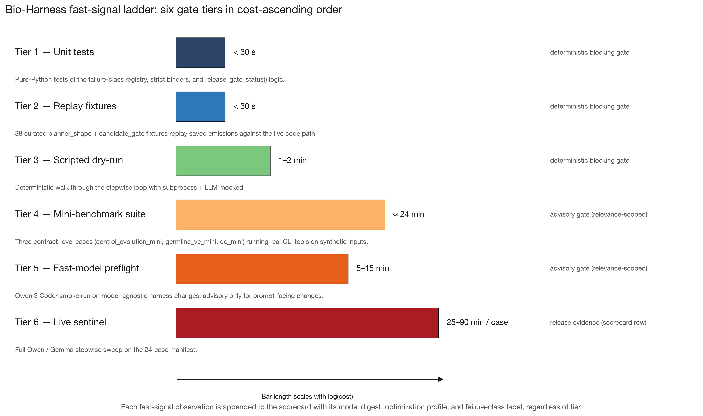
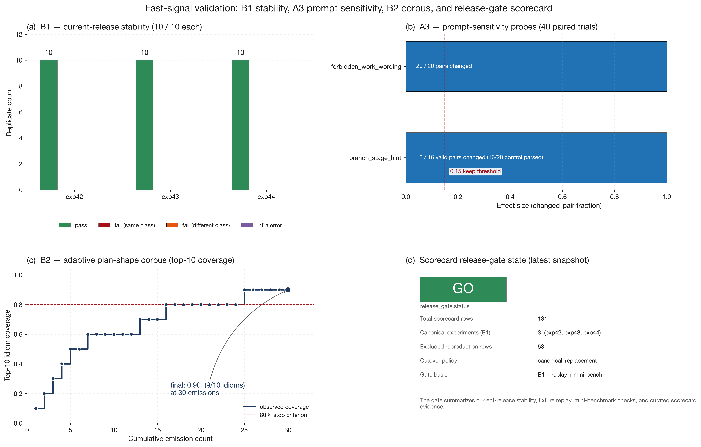
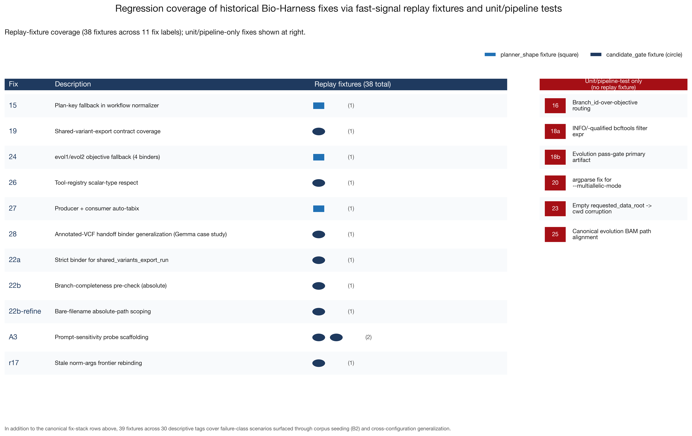
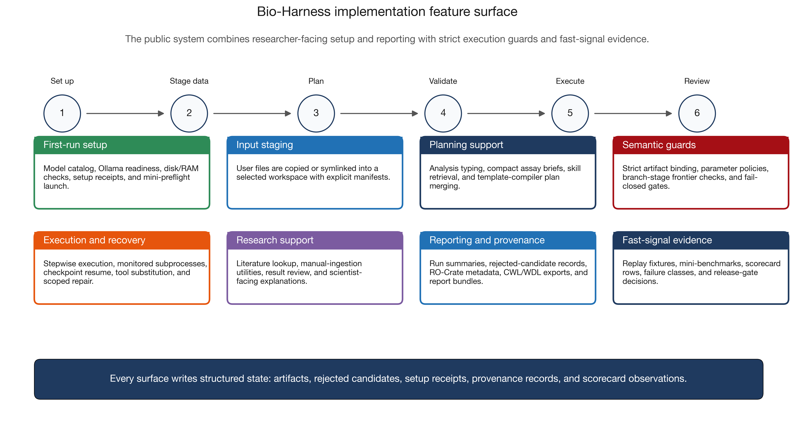
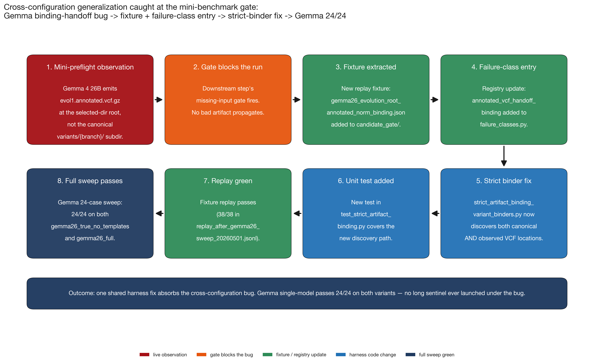
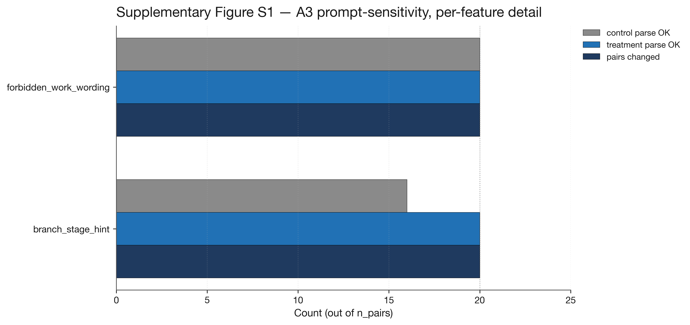
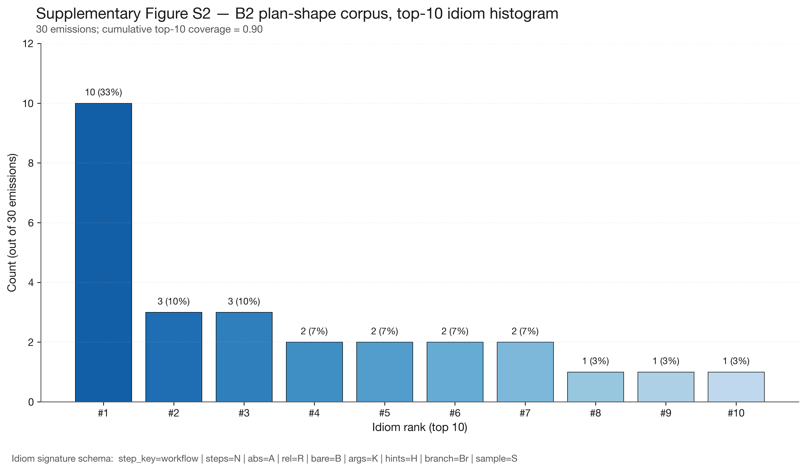
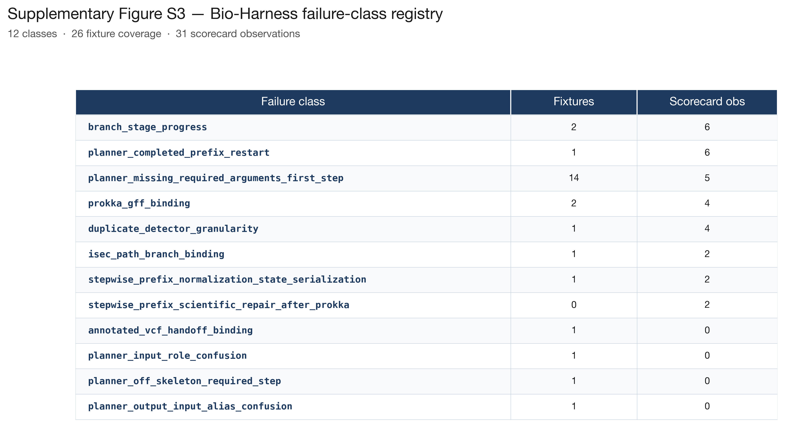

# Bio-Harness: Reliable Local-First Bioinformatics Agents with a Calibrated Fast-Signal Methodology

**Author:** Jared Richardson

**Code:** [`github.com/jared-richardson/BioHarness`](https://github.com/jared-richardson/BioHarness)

> This is the repository-rendered manuscript page. A permanent publication link will be added after the manuscript is posted.

**Quick navigation:** [Abstract](#abstract) · [System Architecture](#3-system-architecture) · [Fast-Signal Methodology](#4-fast-signal-methodology) · [Evaluation](#6-evaluation) · [Discussion](#7-discussion) · [References](#references)

**Manuscript status:** This manuscript has not been peer-reviewed. It is shared as a public draft to enable community feedback on both the system and the methodological contributions before journal submission.

---

## Abstract

Bioinformatics pipelines chain dozens of specialized tools with format-specific inputs and interdependent parameters, and while LLM agents can draft these pipelines from natural language, they hallucinate tool names, misconfigure domain-specific defaults, and fail silently with scientifically meaningless output. Cloud-only models compound the problem by requiring genomic data to leave institutional control and by imposing unpredictable per-token costs on multi-turn agentic loops.

We present Bio-Harness, a local-first autonomous bioinformatics agent that combines LLM-driven planning with eleven deterministic template compilers, strict artifact-binding contracts, and a calibrated fast-signal regression methodology. The system supports configurable model-role deployment validated across two open model families (Qwen and Gemma) without requiring any cloud API call.

Across six paired 24-case variant sweeps, Bio-Harness passes 144/144 case-runs with zero automatic repairs, zero fallbacks, and zero fail-open events across validated Qwen split-local and Gemma single-model configurations. In an additional public-mode deployment-readiness sweep, single-model Qwen Coder also passes 24/24 cases under the default template-assisted configuration. The accompanying fast-signal ladder — 38 replay fixtures, a 30-replicate stability baseline, 40 paired prompt-sensitivity trials, an adaptive plan-shape corpus, and a 131-row calibrated scorecard — converts each live failure into a durable regression artifact.

We argue that publishing the release gate alongside the pass rate, rather than reporting single-run results, is the durable methodological contribution.

---

## 1. Introduction

### 1.1 The pipeline-assembly bottleneck

Modern bioinformatics analyses chain four to twelve specialized tools per pipeline (alignment, variant calling, quantification, statistical testing, annotation, visualization). Each tool exposes format-specific inputs (FASTQ, BAM, VCF, GFF), interdependent parameters (ploidy, strand-specificity, codon tables), and version-sensitive behavior. Workflow languages such as Nextflow [1], Snakemake [2], CWL [3], and Galaxy [4] reduce the *execution* burden of running these pipelines, but each still requires a human expert to author the workflow specification itself. The bottleneck has moved from execution to authorship.

### 1.2 LLM agents: promise and pitfalls

Large language model agents demonstrate strong ability to draft pipeline structures from natural-language descriptions and to choose tools appropriate to a stated research goal. ReAct [5], Toolformer [6], and Plan-and-Solve [7] established generic patterns for combining reasoning and tool use. But standalone agents exhibit systematic failure modes in bioinformatics: they hallucinate tool names and parameters that do not exist, set incorrect domain-specific defaults, produce format mismatches between pipeline steps, and most insidiously fail silently — completing successfully with valid-format outputs that are scientifically meaningless.

For example, an agent asked to call bacterial variants may set ploidy=2 (the human default), silently producing incorrect variant calls that pass all format checks. The downstream researcher, trusting the pipeline completed without error, may build an entire analysis on corrupted variants — wasting weeks of interpretation before the mistake surfaces in peer review or, worse, never surfacing at all.

Cloud-only models exacerbate the problem because they require sending potentially sensitive genomic data to external endpoints, conflicting with HIPAA, GDPR, and institutional policies. They also make operating costs difficult for laboratories to predict: a single multi-turn agentic analysis that retries and recovers through a long pipeline can accumulate thousands of tokens of context per attempt, and the total cost of an exploratory session is difficult to predict in advance. Open-source local models reduce these constraints, but they are smaller than frontier cloud models and have historically been more error-prone on multi-step pipeline assembly.

A second, less-studied problem is that agent runs are stochastic. Recent work documents that frontier-model pass@1 scores can collapse under repeated sampling: τ-bench reports that 60% pass@1 corresponds to ~25% consistency across ten replicates [8]; ReliabilityBench [9] formalizes pass^k consistency as a primary reliability metric; "Capable but Unreliable" [10] argues that the underlying cause is the agent's deviation from the canonical execution path. None of this is well-captured by single-run benchmarks.

### 1.3 Our approach

Bio-Harness combines three ideas that target both the correctness and the calibration problems:

- **A template-compiler hybrid planning architecture.** The LLM produces an initial plan; eleven domain-specific compilers patch it via a signal-equivalence-based merge that preserves planner flexibility while enforcing parameter correctness and tool ordering.
- **A configurable model-role architecture for local-first deployment.** The harness supports either a single local model serving both planner and executor roles or two separate local models, with the configuration declared per launch. This lets the same system run across different open model families and different hardware budgets without sending data to a cloud API.
- **A calibrated fast-signal methodology.** Each live failure is converted into a replay fixture, a registry-backed failure-class label, and a scorecard observation. A six-tier ladder lets harness changes be evaluated against reproduction-rate context — instead of trusting a single passing run, the gate considers how often the same test has historically passed or failed — rather than single-run anecdotes.

### 1.4 Contributions

This paper makes the following contributions:

1. **Template-compiler hybrid planning architecture** with eleven domain-specific compilers and signal-equivalence-based plan merging, where signal equivalence means that tools fulfilling the same biological role (e.g., freebayes and bcftools for variant calling) are treated as interchangeable during plan comparison (§3.2).

2. **Configurable model-role architecture for local-first execution**, validated across two open model families and three practical deployment shapes: split-local Qwen, single-model Gemma, and a single-model Qwen Coder public-mode deployment path (§3.1, §6.4).

3. **24-case BioAgentBench-style manifest** with three bands and **144/144 case-runs across six paired variant sweeps** with zero repairs/fallbacks/fail-opens, plus an additional **24/24 public-mode deployment-readiness result** under single-model Qwen Coder (§6.1, §6.3, §6.4).

4. **Calibrated fast-signal methodology**: 38 curated replay fixtures, a 30-replicate stability baseline, 40 paired prompt-sensitivity trials, an adaptive plan-shape corpus, a three-case mini-benchmark suite, and a registry-backed failure-class taxonomy (§4).

5. **Open-source local-first implementation** with worked cross-configuration generalization (the Gemma case study, §6.5) and an explicit reproduction-rate-context-aware release-gate policy (§4.5, §7.4). Codebase statistics at the time of evaluation (2026-05-01): 119,258 Python lines, 399 Python files, 3,514 collected tests (see Appendix E).

To our knowledge, Bio-Harness is the first published agentic bioinformatics harness with an explicit release-gate policy backed by reproduction-rate context, and the first to align fixture taxonomy to the agent's two distinct decision surfaces (parsing pipeline vs control loop).

---

## 2. Related Work

We organize related work into four threads: bioinformatics workflow engines, LLM agents for scientific computing, replay-based regression for agents, and stochastic-LLM consistency benchmarking. We distinguish academic peer-reviewed sources, which we cite for scientific positioning, from industry / blog sources, which we cite as production-practice context only.

### 2.1 Bioinformatics workflow engines

Nextflow [1], Snakemake [2], Galaxy [4], and CWL/WDL [3] dominate the bioinformatics-pipeline tooling landscape. Each provides reproducibility, container support, and provenance, but each requires a human expert to author the workflow specification. Bio-Harness occupies a different role: rather than executing a human-authored workflow, it produces and executes the workflow from a natural-language analysis goal.

### 2.2 LLM agents for scientific computing

ReAct [5], Toolformer [6], and Plan-and-Solve [7] established generic agent patterns. AutoML systems for biological sequence analysis [11] target a narrow set of analysis types and are not general workflow agents. Multi-agent frameworks (CAMEL, AutoGen, CrewAI) provide generic tool-use scaffolding but lack domain-specific template validation. To our knowledge, no prior published system combines LLM planning with deterministic domain-specific template compilers for bioinformatics.

GeneBench (Li & Ho, 2026 [12]) is a recent multi-stage statistical-inference benchmark in genomics with 103 problems across 10 domains. Frontier models top out around 25–33% pass rate. GeneBench probes a different capability than Bio-Harness — statistical inference rather than pipeline execution — and its data has not been publicly released as of submission. We discuss it in §7 as future work.

### 2.3 Replay-based regression for agents

The general pattern of capturing failed runs as fixtures and replaying them as regression tests is well-known in production-engineering practice. Industry guides such as Anthropic's "Demystifying evals for AI agents" [I-1], the Atlan six-layer guide [I-2], Galileo's agent evaluation framework [I-3], Braintrust's agent-evaluation framework [I-4], and Sakurasky's deterministic-replay note [I-5] each describe versions of this loop. We cite these as production context. To our knowledge, no peer-reviewed academic source describes the architectural split we propose between `planner_shape` fixtures (parsing-pipeline regression) and `candidate_gate` fixtures (control-loop regression), aligned to the two distinct decision surfaces of an agentic harness.

### 2.4 Stochastic-LLM consistency benchmarking

ReliabilityBench [9] and the Holistic Agent Leaderboard [13] formalize multi-run consistency as a primary metric. τ-bench [8] reports the headline finding that 60% single-run pass rate can correspond to only ~25% multi-run consistency. "Capable but Unreliable" [10] proposes canonical-path deviation as the underlying mechanism. ReasonBENCH [14] benchmarks the (in)stability of LLM reasoning specifically. All of these treat reproduction rate as a *reported metric*. Bio-Harness treats reproduction rate as a *calibration constant* for the ground-truth label of "fix confirmed working" — the policy is presented in §4.5 and discussed in §7.4.

### 2.5 End-to-end harness optimization

Meta-Harness [15] runs an LLM-driven outer loop over harness code, achieving +7.7 points on TerminalBench-2 over hand-engineered baselines. HARBOR [16] presents a related automated-harness-optimization framework. The Agent Harness Survey [17] provides broader positioning. Bio-Harness occupies a complementary point in the design space: human-driven harness with calibrated measurement, rather than LLM-driven outer-loop search. The two approaches are not competitive — a fast-signal ladder could in principle serve as the fitness function for a Meta-Harness outer loop, although we do not pursue this direction here.

---

## 3. System Architecture

Figure 1 shows the high-level Bio-Harness architecture: configurable planner / executor model roles feed a four-phase execution pipeline (planning, validation, execution, recovery), with the fast-signal ladder layered on top and a calibrated scorecard recording every event.

**Figure 1.** Bio-Harness architecture. Top: configurable model deployment supports three validated paths — single-model (Gemma 4 26B or Qwen Coder in public mode) or split-local (Qwen 3.6 35B-A3B planner + Qwen 3 Coder executor). Middle: the four-phase pipeline runs identically under all configurations. Bottom: every event is recorded in the calibrated scorecard with model digest, optimization profile, and failure-class label.

### 3.1 Overview

The harness is organized around six cooperating layers: a skill registry mapping declarative skill files to Python wrappers; analysis typing and compact assay briefing; budgeted skill navigation through a bounded subset of relevant skills; multi-stage hierarchical planning; pre-execution contract / protocol / semantic validation; and monitored execution with focused repair on failure. The fast-signal ladder (§4) is layered on top of all six.

### 3.2 Configurable model-role architecture

Bio-Harness exposes two configurable model slots — `BIO_HARNESS_MODEL_HEAVY` (planner) and `BIO_HARNESS_MODEL` (executor) — that can be set to the same local model (single-model deployment) or to different local models (split-local deployment). We validate two paired strict + public release configurations and one additional public-mode deployment path:

- **Single-model deployment (Gemma).** `gemma4:26b` runs both planner and executor. This minimizes total VRAM and operational complexity and is suited to consumer-class hardware.
- **Split-local deployment (Qwen 3.6).** `qwen3.6:35b-a3b` (35B parameters, 3B active via mixture-of-experts) acts as planner, with `qwen3-coder-next:latest` as executor. This trades higher VRAM for faster execution on shell-and-tool tasks and is the strict-stress evidence for harness hardening.
- **Single-model deployment (Qwen Coder, public-mode only).** `qwen3-coder-next:latest` runs both planner and executor under the `qwen_full` variant. This is the one-model-download Qwen path for the public/default mode. Strict no-template stress evidence for single-model Qwen Coder is not part of the validated claim; the strict evidence remains the split-local Qwen 3.6 configuration.

Per Table 2, all three configurations are run with `ollama-0.20.0` as the inference backend. None requires a cloud API call.

### 3.3 Template-compiler hybrid (primary architectural contribution)

The core design decision is that pure LLM planning is creative but unreliable on domain-specific parameters, while pure template systems are reliable but inflexible. Eleven domain-specific compilers resolve this tension through a five-stage process:

1. The LLM generates an initial plan (creative, context-aware).
2. An analysis-type classifier maps the request to one of fifteen canonical types.
3. If a template compiler exists for that type, it generates a reference plan from domain knowledge and the discovered input data.
4. A hybrid merge function combines the LLM plan with the template via greedy forward matching by signal equivalence — meaning that tools fulfilling the same biological role are treated as interchangeable (e.g., both `freebayes_call` and `bcftools_call` satisfy the abstract signal `"variant_calling"`), so the LLM can pick its preferred variant without breaking template matching.
5. A `PARAMETER_KNOWLEDGE_BASE` fills critical defaults (ploidy, library type, codon tables, output formats) as a final pass.

**Worked example: template-compiler merge for bacterial evolution.** Suppose the LLM generates a plan that uses `bcftools_call` for variant calling and omits the ploidy parameter. The bacterial evolution compiler generates a reference plan using `freebayes_call` with `ploidy=1`. During the merge, the signal-equivalence dictionary maps both tools to the `"variant_calling"` signal, so the LLM's choice of `bcftools_call` is preserved — but the compiler's `ploidy=1` parameter is injected because it is a critical default that the LLM omitted. The merge also enforces that alignment precedes variant calling and that the reference genome from assembly is threaded correctly through both steps. The result is a plan that respects the LLM's tool preferences while guaranteeing domain-correct parameters and ordering.

The eleven compilers cover bacterial evolution, RNA-seq differential expression, transcript quantification, metagenomics classification, single-cell RNA-seq, germline variant calling, variant annotation, comparative genomics, viral metagenomics, multi-model differential expression with pathway analysis, and phylogenetics.

### 3.4 Stepwise prefix immutability

Once a step has run and produced output, the harness treats it as evidence. No future planning step is allowed to retroactively change what already happened. This simple invariant prevents a class of failures where the planner, upon encountering an error, attempts to rewrite history rather than working forward from the current state. A branch-stage frontier — which tracks that each evolved lineage (or sample, or condition) progresses through pipeline stages independently — rebinds new candidate steps to the current scaffold before duplicate and artifact checks, so a planner emission with stale arguments but the right tool choice is recovered into a valid step rather than rejected outright.

---

## 4. Fast-Signal Methodology

A full 24-case benchmark sweep takes roughly two hours. When a harness change introduces a regression, waiting for the full sweep to detect it wastes that time — and a single passing sweep afterward does not prove the fix is reliable, because LLM-agent runs are stochastic. Bio-Harness addresses both problems by converting each failure discovered in a full sweep into a faster, deterministic test. For example, when a full sweep reveals that the planner emits an empty `branch_id` for a bcftools intersection step, the failing emission and its execution context are saved as a replay fixture that re-tests the same decision point in seconds rather than hours. Over time, this builds a ladder of increasingly realistic checks — from unit tests and replay fixtures (seconds) through mini-benchmarks (minutes) to full sweeps (hours) — where each tier blocks known failure classes before the slower tiers run. Every check is tied to a scorecard row and a registry-backed failure class, so the evidence accumulates rather than resetting with each new run.

**Figure 2.** The Bio-Harness fast-signal ladder. Six gate tiers are ordered from deterministic unit tests to full live sentinels. Tiers 1–3 catch parsing, binding, and control-loop regressions in seconds. Tiers 4–5 exercise real tools on small inputs or fast-model preflights. Tier 6 is the full Qwen or Gemma benchmark sweep and supplies calibration evidence for future gates.

### 4.1 Definitions

An **observation** is one sampled agent run, with model digest, backend version, sampling configuration, and optimization profile recorded. A **fixture** is a deterministic replay object that pins one agent decision surface. A **failure class** is a canonical label from the registry used to group observations. A **gate** returns `{go, wait, blocked}` over scoped evidence. A **scorecard row** is the append-only record connecting the observation, failure class, model provenance, gate decision, and any override metadata.

### 4.2 Ladder Design

The six tiers are deliberately asymmetric. Unit tests, replay fixtures, and scripted dry-runs run quickly and block known failures. Mini-benchmarks and fast-model preflights run real execution paths on small inputs and provide advisory evidence. Full live sentinels remain the final validation layer, but they are launched only after the relevant faster gates are green. This turns a slow fix loop into a measurement loop: failures discovered in a full run become fixtures or mini-benchmarks that prevent the same class of failure from reaching the next full run.

### 4.3 Replay Fixture Surfaces

Bio-Harness separates replay fixtures by the two places an agent can go wrong.

**`planner_shape` fixtures** replay raw LLM emissions through parsing, workflow normalization, compiler repair, binding, and contract verification. For example, a planner_shape fixture might contain the raw YAML output from Qwen 3.6 that uses `plan:` as the top-level key instead of the expected `workflow:` — the fixture verifies that the normalizer's fallback-key logic (Fix #15) still recovers this emission into a valid workflow structure.

**`candidate_gate` fixtures** replay a saved stepwise prefix (the steps already executed) and a proposed next step through duplicate detection, branch-stage frontier checks, binding, and contract validation. For example, a candidate_gate fixture might contain a six-step executed prefix for a bacterial evolution run plus a proposed `bcftools_isec_run` step with empty arguments — the fixture verifies that the missing-input pre-check (Fix #22b) correctly rejects the candidate before it can corrupt the executed prefix.

The current library contains 38 fixtures (7 `planner_shape` and 31 `candidate_gate`). This split matters because a parser regression and a control-loop regression can look similar in a final failed run but need different tests.

**Figure 3.** Fast-signal validation. (a) B1 current-release stability baseline: 10 replicates each for exp42, exp43, and exp44, all passing. (b) A3 prompt-sensitivity probes: 40 paired trials across two prompt features, both above the 0.15 keep threshold; `forbidden_work_wording` changed 20/20 valid pairs, `branch_stage_hint` changed 16/16 valid parsed pairs (4/20 control parse failures excluded per protocol). (c) B2 adaptive plan-shape corpus: per-emission data showing 30 emissions reaching top-10 idiom coverage of 0.90. (d) Scorecard release-gate state: 131 rows, status `go` after the canonical B1 cutover.

### 4.4 Measurement Studies

**B1 current-release stability baseline.** The B1 baseline re-ran three historically unstable experiments — exp42, exp43, and exp44 — ten times each under the current release harness. These three were chosen because they had the highest failure rates during the Qwen 3.6 stabilization campaign: exp42 exposed the `output_type` parameter-classification bug (Fix #26), exp43 exposed the missing tabix-index failure (Fix #27), and exp44 exposed a bcftools multiallelic-mode parsing failure (Fix #20). All 30 replicates passed, so the current-release same-class reproduction rate for these cases is 0.0 (Figure 3a). This is stability evidence for the current release, not a claim that every historical pre-fix failure class has been exhaustively re-sampled.

**A3 prompt-sensitivity study.** The A3 study asked whether two prompt features actually change planner behavior. The `forbidden_work_wording` and `branch_stage_hint` features were each tested with 20 paired control/treatment trials. For `forbidden_work_wording`, all 20 controls and 20 treatments parsed successfully, and all 20 pairs showed different emissions (effect size 1.0). For `branch_stage_hint`, 16/20 control emissions parsed successfully; the four control parse failures were excluded from the paired comparison per the pre-declared protocol, and the remaining 16/16 valid parsed pairs all showed different emissions (effect size 1.0 over the 16 valid pairs). Features below the pre-declared 0.15 threshold would be removed rather than treated as meaningful controls.

**B2 adaptive plan-shape corpus.** The B2 corpus characterized planner-output idioms under the current prompt and model configuration. Sequential sampling stopped when the top-10 idioms covered at least 80% of emissions; the corpus reached 90% coverage at 30 emissions with 29/30 parse success (Figure 3c, which shows actual per-emission data). The adaptive corpus seeds new replay fixtures from observed model behavior rather than from cherry-picked failures.

### 4.5 Scorecard and Release Gate

The scorecard is the memory of the methodology. It stores model digest, backend version, optimization profile, failure-class identifier, gate, status, and override metadata for each observation. The current scorecard contains 131 rows. Its release gate returns `go`, `wait`, or `blocked` using hard preconditions (reproduction baseline present, relevant replay fixtures green, relevant dry-run and mini-benchmark gates green) and soft preconditions (preflight green, corpus baseline fresh, snapshot fresh). A gate is promoted to blocking only after sustained precision and false-negative thresholds are met.

### 4.6 Historical Failure Coverage

The current fixture library and focused unit/pipeline tests cover the historical fix stack that was accumulated during Qwen 3.6 stabilization and later Gemma generalization. The figure separates fixes covered by replay fixtures from wrapper/evaluator fixes that are better guarded by direct unit or pipeline tests.

**Figure 4.** Regression coverage of historical Bio-Harness fixes. Replay-fixture coverage is shown by surface (`planner_shape` in light blue, `candidate_gate` in dark blue). Fixes #16, #18a, #18b, #20, #23, and #25 are covered by unit or pipeline tests rather than replay fixtures because they exercise deterministic wrapper or evaluator behavior rather than LLM-output parsing.

---

## 5. Implementation

Bio-Harness is intended to be usable by researchers who need to run bioinformatics analyses locally without deep pipeline-engineering expertise. This section describes what the researcher experiences at each phase.

**Figure 5.** Researcher-facing Bio-Harness feature surface. The public system combines first-run setup, model readiness checks, input staging, planning support, semantic validation, monitored execution, review utilities, reporting/provenance, and the fast-signal evidence loop. Each surface writes structured state so user-facing workflows and regression evidence remain connected.

### 5.1 Setup

On first run, the system checks for the managed software environment (pixi), validates that required command-line tools are available, inspects model availability through Ollama, and reports disk and memory requirements. The setup flow guides users toward a recommended local model — either the one-download Qwen Coder public path, the Gemma single-model path, or the Qwen split-local path — and records a setup receipt so later failures can be distinguished from environment problems.

### 5.2 Planning

When the researcher submits an analysis goal in natural language, the harness classifies the request, retrieves only the relevant skills from the registry, builds a bounded planning context, and sends the request to the planner model. If a template compiler exists for the classified analysis type, the LLM plan is merged with the compiler's reference plan as described in §3.3. The researcher sees the final plan with tool choices, parameters, and ordering — and can inspect which parameters came from the LLM versus the compiler.

### 5.3 Execution

Before each step runs, strict artifact binding checks that every declared input resolves to an existing, typed upstream artifact, preventing phantom-file errors from propagating. If a required input is missing or untyped, execution fails closed — meaning it stops rather than fabricating or guessing a scientific artifact. Parameter policies reject placeholder values, unsafe shell commands, and workflow bypasses. During execution, monitored subprocesses with heartbeat checks keep failures local and diagnosable. If a step fails, checkpoint sidecar files allow resume from the last completed step rather than restarting from scratch.

### 5.4 Output

Each completed run produces human-readable summaries, structured provenance metadata, and the analysis artifacts themselves. Rejected candidate records include enough state to seed future regression fixtures, closing the loop from live failure to durable test. The same reporting layer supports run inspection, report regeneration, and workflow-language exports.

---

## 6. Evaluation

The evaluation is designed to answer two questions: whether the harness survives the 24-case manifest under strict and public policies, and whether that reliability is tied to one model family or one deployment shape. Qwen split-local and Gemma single-model provide the paired strict + public validation evidence. A separate single-model Qwen Coder `qwen_full` sweep tests the practical public-mode question of whether a one-model Qwen deployment can pass the manifest. The evaluation also asks whether the fast-signal methodology actually catches and preserves failures, and how much of the reliability comes from harness engineering rather than from any one model.

### 6.1 24-Case Manifest

The manifest has three bands.

**Six control cases** exercise common canonical workflows: bacterial evolution, RNA-seq differential expression, germline variant calling, transcript quantification, phylogenetics, and single-cell RNA-seq.

**Ten domain-extension cases** test broader bioinformatics coverage, including long-read structural variants, assembly, spatial transcriptomics, proteomics, metabolomics, metagenomics, viral metagenomics, variant annotation, pathway-aware differential expression, and clinical variant identification.

**Eight stress cases** introduce adversarial conditions: missing inputs, noisy prompts, malformed requests, and pathologies that should trigger recovery or graceful refusal rather than fabricated science. For example:

- `stress_noisy_evolution`: *"I have some bacteria that were evolved in a lab. Can you find the mutations that happened during the experiment? There should be some sequencing data in the data directory."* — This prompt omits every technical detail (reference genome source, ploidy, read technology, expected output format) and uses colloquial language. The harness must infer bacterial_evolution_variant_calling, discover the correct input files, and produce a valid shared-variants result without hallucinating parameters.

- `stress_noisy_deseq`: *"I did an RNA experiment with treated and untreated cells. Tell me which genes changed. The files are in the data folder."* — This prompt provides no information about organism, library type, replicate structure, or statistical thresholds. The harness must classify the request as differential expression, discover FASTQ files and infer condition labels from filenames, and run a complete STAR-featureCounts-DESeq2 pipeline with appropriate defaults.

These stress prompts are deliberately written at the level of detail a bench biologist might provide when asking a colleague for help — no bioinformatics jargon, no parameter specifications, no tool preferences.

### 6.2 Model Configurations

We evaluate two open model families. The Qwen split-local configuration uses `qwen3.6:35b-a3b` as planner and `qwen3-coder-next:latest` as executor. The Gemma single-model configuration uses `gemma4:26b` for both planner and executor. Both are evaluated under strict no-template and public full variants. We also run a deployment-readiness sweep in which `qwen3-coder-next:latest` acts as both planner and executor under the public `qwen_full` variant (§6.4).

### 6.3 Main Benchmark Result

Across six paired 24-case sweeps — four Qwen split-local sweeps and two Gemma single-model sweeps — Bio-Harness passes **144/144** case-runs with zero automatic repairs, zero protocol-template fallbacks, zero generic fallbacks, and zero planner fail-open events (that is, the planner never gave up and let the agent proceed with unchecked output). The same 24 cases pass under two model families, two deployment shapes, and both strict and public settings.

"Repairs" here means harness-triggered automatic workflow repair after execution failure: the six-step recovery ladder never fired during any sweep. Pre-execution plan construction — template patching, parameter-knowledge-base filling, strict artifact binding, and frontier rebinding — runs unconditionally on every plan as part of normal operation and is not counted as a repair. The recovery ladder is reserved for runtime failures (tool crashes, missing outputs, resource exhaustion) that occur after a step begins execution.

**Table 3.** Sweep results.

| Sweep | Variant | Config | Pass/Count |
|---|---|---|---|
| Qwen release sentinel (strict) | qwen_true_no_templates | split-local | 24/24 |
| Qwen release public (full) | qwen_full | split-local | 24/24 |
| Qwen post-mini-gate (strict) | qwen_true_no_templates | split-local | 24/24 |
| Qwen post-mini-gate (full) | qwen_full | split-local | 24/24 |
| Gemma final generalization (strict) | gemma26_true_no_templates | single-model | 24/24 |
| Gemma final generalization (full) | gemma26_full | single-model | 24/24 |
| **Paired Total** | — | — | **144/144** |
| *Qwen Coder deployment (full only)* | qwen_full | single-model | 24/24 |
| **Deployment Total** | — | — | **24/24** |

All sweeps report zero automatic repairs, zero generic fallbacks, zero protocol-template fallbacks, and zero planner fail-open events. The Qwen Coder deployment row is a one-sided qwen_full validation, not a paired strict + public evaluation.

Per-case runtimes ranged from 8.7 seconds (`stress_noisy_deseq`, a minimal prompt that triggers quick classification and template-driven completion) to 2,763 seconds (`control_deseq`, a full STAR → featureCounts → DESeq2 pipeline with genome indexing). The runtime spread reflects genuine computational work rather than retry overhead.

**Figure 6.** 24-case manifest results across six paired variant sweeps plus one public-mode deployment-readiness sweep. The six paired columns are four Qwen split-local sweeps and two Gemma single-model sweeps, all green (144/144). The seventh column shows an additional single-model Qwen Coder `qwen_full` sweep, also green (24/24), supporting a one-model Qwen path for the public/default mode. The Qwen Coder column is not a strict no-template validation.

### 6.4 Single-Model Qwen Coder Public-Mode Deployment Validation

To test whether users need two Qwen model downloads, we ran an additional deployment-readiness sweep using `qwen3-coder-next:latest` as both planner and executor. Under the default template-assisted `qwen_full` configuration, the single-model Qwen Coder run passed all 24 manifest cases — 6/6 control, 10/10 domain extension, and 8/8 stress — with zero automatic repairs, zero generic fallbacks, zero protocol-template fallbacks, and zero planner fail-open events. Mean per-case runtime was 280.4 seconds. This establishes a one-model Qwen path for the public/default mode.

The strict no-template stress evidence remains the split-local Qwen configuration, where `qwen3.6:35b-a3b` serves as planner and Qwen Coder serves as executor. The deployment-readiness sweep does not claim that single-model Qwen Coder passes the strict `qwen_true_no_templates` variant; that evaluation is deferred to future work.

### 6.5 Cross-Family Case Study: Gemma Binding-Handoff Bug

The most informative failure in the campaign came from Gemma. A mini-benchmark preflight found that Gemma, when running the `snpeff_annotate` step for germline variant calling, wrote the annotated VCF to the branch root directory (`selected/germline/`) rather than the canonical subdirectory (`selected/germline/variants/`). Both locations are defensible — Gemma's output was a valid annotated VCF in a sensible place — but the strict artifact binder expected only the canonical path. The missing-input gate blocked the next step (variant filtering) before a downstream tool could fail with an opaque "file not found" error.

We converted the failure into a replay fixture (`candidate_gate` surface, failure class `binding_handoff_branch_local`), added a failure-class registry entry, and generalized the strict binder to accept both the canonical subdirectory path and the observed branch-local path. The generalization was a small change to the path-resolution logic — not a Gemma-specific prompt hack. We then reran the replay fixture (green), the mini-benchmark (green), and the full Gemma 24-case sweep (24/24 under both strict and public variants).

**Figure 7.** Cross-family bug caught at the mini-benchmark gate. A Gemma-specific artifact-location idiom surfaced during mini-preflight, was blocked by the missing-input gate, converted into a replay fixture and failure-class entry, fixed in the strict binder, and then validated by the full Gemma sweep. The same generalized code path supports both Qwen split-local and Gemma single-model execution.

This case study is the best evidence that the harness is not merely tuned to one model family. Qwen and Gemma expressed the same biological workflow with different artifact-location idioms; the fast-signal ladder exposed the mismatch early, and the resulting binder fix generalized the harness rather than adding model-specific prompt text.

### 6.6 Fast-Signal Evidence Summary

Independent of the full benchmark sweeps, the fast-signal layer produced green evidence across 38 replay fixtures, 30 B1 stability replicates, 40 paired A3 prompt-sensitivity comparisons, the adaptive B2 corpus, the three-case mini-benchmark suite, and the focused fast-signal test gate. Together, these results support the methodological claim that the harness has a durable regression loop, not only a collection of successful final runs.

### 6.7 Ablations and Non-Claims

We report only ablations that were actually run. Strict no-template and public full variants both pass under Qwen split-local and Gemma single-model configurations. Earlier recovery ablations showed that disabling recovery reduced Qwen performance on the original BioAgentBench-style set. We do not report a "fast-signal ladder on/off" ablation because the ladder changes the development process itself; instead, we evaluate it through replay, mini-benchmark, and case-study evidence.

**Table 4.** Ablation results.

| Ablation | Qwen 3.6 (split-local) | Gemma 4 26B (single-model) | Notes |
|---|---|---|---|
| Full (baseline) | 24/24 strict + 24/24 full | 24/24 strict + 24/24 full | primary release evidence |
| Strict vs full | 24/24 == 24/24 | 24/24 == 24/24 | no policy-mode penalty |
| Cross-configuration | split-local | single-model | both reach 24/24 from the same code path |
| Templates ON/OFF (66 runs) | 11/11 (full); 10/11 (no_templates) | 11/11 (full) | earlier BioAgentBench ablation (pre-fix) |
| Recovery ON/OFF | 11/11 to 9/11 | 11/11 to 10/11 | timeout without recovery |

**Table 5.** Related work comparison.

| System | Primary contribution | Measurement strategy | Local-first |
|---|---|---|---|
| Bio-Harness (this work) | Bioinformatics agent + fast-signal + release-gate | 38 replay fixtures; B1/A3/B2; 131-row scorecard | Yes |
| Meta-Harness [15] | LLM-driven outer-loop search over harness code | TerminalBench-2 fitness; no replay fixtures | No |
| HARBOR [16] | Automated harness optimization | Benchmark-tied metric; not domain-specific | Backend-dependent |
| ReliabilityBench [9] | Stochastic-LLM agent reliability benchmark | pass^k consistency metric | Backend-dependent |
| GeneBench [12] | Multi-stage statistical inference in genomics | 103 problems; 25-33% pass rate at frontier | Backend-dependent |

---

## 7. Discussion

### 7.1 Reliability Comes from Harness Design, Not One Model

The most important result is not only that Bio-Harness passed the manifest, but that it did so across two different open model families. Qwen split-local and Gemma single-model differ in architecture, size, and output habits; both nevertheless reached 24/24 under strict and public variants. This argues against a narrow interpretation in which the harness merely learned one model's quirks.

Bio-Harness began as a prototype that passed 11/11 on an initial benchmark. When we expanded to 24 cases and introduced Qwen 3.6, 14 new failure classes emerged over fixes #15–#28. Each failure — for example, bcftools parameter ambiguity where unqualified filter expressions collided with identically named INFO and FORMAT fields, or stepwise prefix mutation where a branch-aggregator emitted before its input producers violated the prefix-immutability invariant — became a fixture, a registry entry, and a scorecard row.

The Gemma case study then demonstrated that fixing these failures through general mechanisms (strict binding, signal equivalence, parameter classification) rather than model-specific patches meant the same code path supported a second model family without additional fixes.

### 7.2 The Hybrid Planning Spectrum

Bio-Harness occupies a middle ground between fully manual workflow languages and fully autonomous agents. The LLM retains the ability to interpret the user's biological goal and choose among valid tool variants. The deterministic harness supplies the parts that should not be improvised: typed artifacts, critical parameters, branch-local provenance, and scientific refusal conditions. The signal-equivalence merge is the mechanism that makes this balance practical because it compares plans by biological role rather than by exact tool name.

### 7.3 Why Local-First Matters

All validated configurations run locally. This matters for privacy because genomic and clinical data often cannot leave an institution. It matters for reproducibility because model tags, digests, tool versions, and run metadata can be pinned together. It matters for accessibility because the public Qwen Coder path requires only one local model download, while Gemma offers a single-model alternative from a different family.

It also matters for cost and iteration speed. A full 24-case Qwen Coder sweep completes in approximately 112 minutes on a consumer workstation (mean 280 seconds per case). Local inference also removes per-token API charges from repeated evaluation. For multi-turn agentic sweeps with long context, this changes benchmarking from a metered cloud expense into a fixed local compute cost, which is particularly important for independent laboratories and the kind of iterative fix-and-rerun development described in §7.1.

### 7.4 Calibrated Measurement as a Scientific Practice

Single-run agent benchmarks are fragile under stochastic sampling [8, 9, 10, 13, 14]. Bio-Harness operationalizes a more conservative practice: publish the release gate alongside the pass rate.

The reproduction-rate calibration works as follows. When a fix is applied and a test passes, the naive interpretation is "fixed." But if the pre-fix reproduction rate for that failure class was only 40% (it failed 4 out of 10 times before the fix), then a single post-fix pass provides weak evidence — the test might have passed by chance even without the fix. The gate does not treat a single post-fix pass as definitive when the pre-fix reproduction rate is low. Instead, reproduction-rate context is reported beside post-fix evidence and combined with hard preconditions: relevant replay fixtures, scripted or mini-benchmark checks, and scoped scorecard status. In practice, low-reproduction failure classes require more corroborating evidence before the release status is treated as stable, while high-reproduction classes (90%+ pre-fix failure rate) provide strong evidence with fewer post-fix passes.

The present evaluation demonstrates the gate machinery, a current-release stability baseline for three historically problematic experiments, a replay library, a mini-benchmark suite, and a scorecard that connects observations to failure classes. That does not eliminate the need for future per-case calibration, but it changes the default standard from "one run passed" to "the relevant evidence is green."

### 7.5 Lessons from Tool-Specific Bugs

The development campaign exposed a long tail of deterministic bioinformatics bugs: mutually exclusive SPAdes flags, SnpEff codon-table naming changes, GATK JVM path requirements, metadata delimiter mismatches, STAR output naming differences, and others. These are not failures that a larger language model can reliably reason away at runtime. They are software-interface facts. Bio-Harness treats them as contract, binder, compiler, or advisory knowledge so they become part of the system rather than repeated surprises.

### 7.6 Limitations

1. **Manifest scope.** The 24-case manifest is a broad test bed, not a proof that every bioinformatics analysis is covered.
2. **Contract-level validation.** Validators check execution, structure, and required artifacts. They do not prove full biological correctness for every output.
3. **Per-case calibration is partial.** Only exp42, exp43, and exp44 have the 10-replicate B1 baseline. The remaining manifest cases have repeated full-sweep evidence but not dedicated per-case reproduction baselines.
4. **Qwen Coder single-model evidence is public-mode only.** Single-model Qwen Coder is validated for the public `qwen_full` mode (§6.4). The strict no-template Qwen evidence remains the split-local Qwen 3.6 configuration.
5. **The adaptive corpus stopped at 30 emissions.** The top-10 idiom coverage criterion was met at 30 emissions; a larger fixed corpus is deferred.
6. **No GeneBench evaluation is included.** GeneBench is discussed as future work because its public data release was not available for this evaluation.
7. **Cross-model idiom-diff and defense-ablation studies are deferred.** These remain useful follow-up studies, especially for future model-family additions.

---

## 8. Conclusion

Bio-Harness demonstrates that local open-source bioinformatics agents can be made reliable by combining LLM-driven planning with deterministic template compilers, strict artifact contracts, and a calibrated fast-signal evidence loop that converts each failure into a reusable regression artifact. Across six paired 24-case variant sweeps under two model families, the system passes 144/144 case-runs with zero repairs; an additional single-model Qwen Coder deployment-readiness sweep passes 24/24 under the public `qwen_full` configuration.

The fast-signal methodology — replay fixtures aligned to decision surfaces, reproduction-rate-aware gating, and a 131-row calibrated scorecard — provides durable evidence beyond any single benchmark result. Future agentic scientific systems should publish their release gate alongside their pass rate. We argue that this practice, more than any specific pass/fail number, is the durable contribution.

### 8.1 Future work

1. **Paired Qwen Coder single-model evaluation.** The current evidence covers single-model Qwen Coder only for `qwen_full` (public-mode deployment-readiness validation); a paired `qwen_true_no_templates` + `qwen_full` single-model Qwen Coder sweep would bring Qwen Coder up to the same paired-evidence standard as Gemma. Future work may also test newer Qwen releases, Llama, Mistral, or Phi as single-model configurations, using the same release-gate policy.
2. **Pre-fix per-class reproduction calibration** for the remaining 21 manifest cases.
3. **Cross-model idiom-diff** across additional open-source families (Llama, Mistral, Phi).
4. **Defense-ablation study** systematically disabling each defense (templates, recovery, fast-signal ladder, branch-stage frontier) to attribute reliability gains.
5. **Domain generalization** — applying the architecture to cheminformatics, geospatial analysis, or climate modeling.
6. **GeneBench LDL pilot** once the benchmark data or an independently reconstructed equivalent is available.
7. **Meta-Harness integration** — using the fast-signal ladder as the fitness function for an LLM-driven harness-optimization outer loop.

---

## Appendices

### Appendix A — 24-case manifest

Table 1 provides the full 24-case manifest with per-case primary artifacts and validator metrics. The public repository includes the manifest definition and reproducibility scripts used to regenerate the table.

**Table 1.** 24-case manifest.

| Band | Case ID | Primary artifact | Validator metric |
|---|---|---|---|
| Control | control_evolution | variants_shared.csv | shared-variant CSV, expected variants |
| Control | control_deseq | deseq_results.csv | DESeq2 result table, gene_counts non-empty |
| Control | control_germline | germline_variants.vcf.gz | VCF present, variant count > 0 |
| Control | control_transcript | transcript_quant.tsv | transcript counts, schema valid |
| Control | control_phylogenetics | tree.nwk | Newick file, RF distance check |
| Control | control_singlecell | clusters.csv | cluster table, marker genes recovered |
| Domain | domain_longread_sv | sv_calls.vcf.gz | VCF present, SV types recovered |
| Domain | domain_longread_assembly | assembly.fasta | assembly FASTA, N50 threshold |
| Domain | domain_spatial | spatial_clusters.csv | spot clusters present |
| Domain | domain_proteomics | protein_quant.tsv | protein quant table |
| Domain | domain_metabolomics | metabolite_table.tsv | metabolite table |
| Domain | domain_metagenomics | kraken2_report.tsv | Kraken2 report, contig N50 |
| Domain | domain_viral_meta | viral_classifications.tsv | viral hits recovered |
| Domain | domain_variant_annot | annotated_filtered.vcf | annotated VCF, impact filter |
| Domain | domain_alzheimer | pathway_comparison.csv | pathway comparison CSV |
| Domain | domain_cystic_fibrosis | causal_variants.csv | causal variant present |
| Stress | stress_longread_wrong_preset | sv_calls.vcf.gz | harness recovers correct preset OR refuses |
| Stress | stress_proteomics_missing | protein_quant.tsv OR error | graceful error or recovery |
| Stress | stress_metabolomics_missing | metabolite_table.tsv OR error | graceful error or recovery |
| Stress | stress_spatial_fragment | spatial_clusters.csv | graceful processing |
| Stress | stress_noisy_evolution | variants_shared.csv | shared variants recovered |
| Stress | stress_noisy_deseq | deseq_results.csv | DE results table |
| Stress | stress_assembly_malformed | (expected refusal) | harness refuses to fabricate assembly |
| Stress | stress_germline_no_rg | germline_variants.vcf.gz | VCF present after harness recovery |

### Appendix B — Template-compiler specifications

The eleven template compilers are defined in `bio_harness/core/protocol_grounding/`. Each has:

- An analysis-type detector that classifies the input request.
- A reference-plan generator that constructs a deterministic correct step sequence.
- A merge function (`_patch_llm_plan_with_template()`) that combines the LLM plan with the reference plan via signal-equivalence matching.

The compilers cover bacterial evolution, RNA-seq differential expression, transcript quantification, metagenomics classification, single-cell RNA-seq, germline variant calling, variant annotation, comparative genomics, viral metagenomics, multi-model differential expression with pathway analysis, and phylogenetics.

### Appendix C — Failure-class registry

The public source tree includes the failure-class registry used by the scorecard. Each class has a canonical name, a description, and a recovery-strategy mapping.

### Appendix D — Fast-signal operational details

Operational details for each ladder tier:

- **B1 sampling protocol.** 10 replicates per experiment with fresh model sampling; rows include `(experiment_id, replicate_id, shard_id, optimization_profile, override_metadata, model_digest, backend_version)`. Same-class failure classification uses an explicit `same-class-marker` regex per experiment.
- **A3 paired-comparison methodology.** Each feature is tested with 20 paired (control, treatment) prompt pairs at fixed temperature 0.3. The pair is "changed" if the treatment emission's parsed plan differs structurally from the control's. Effect size = changed_pairs / pairs_compared. Features with effect_size ≥ keep_threshold (0.15) are retained as harness-bound prompt features. Supplementary Figure S1 gives the per-feature detail.

**Supplementary Figure S1.** Per-feature A3 prompt-sensitivity counts for control parse success, treatment parse success, and changed pairs.

- **B2 adaptive stopping.** Sequential sampling continues until top-10 idiom cumulative coverage ≥ 80%; otherwise tail risk is documented. Idiom signature schema: `step_key=workflow|steps=N|abs=A|rel=R|bare=B|args=K|hints=H|branch=Br|sample=S` (see Supplementary Figure S2).

**Supplementary Figure S2.** Top-10 plan-shape idiom histogram from the adaptive B2 corpus.

**Supplementary Figure S3.** Failure-class registry summary with fixture and scorecard-observation counts per canonical class.

- **Release-gate policy.** `release_gate_status()` returns `{go, wait, blocked}` over scoped evidence. Hard preconditions: reproduction baseline exists, relevant replay fixtures green, relevant scripted dry-run green, relevant mini-benchmark green, no `blocking_ready` gate has regressed, no relevant red fixture is being bypassed. Soft preconditions: preflight green, corpus baseline fresh, snapshot fresh. Override metadata: `--override-gate-status`, `--override-reason`, `--measurement-purpose`, source issue. Overrides are auditable in the scorecard.
- **Override audit.** Every override appears as a scorecard row with `override_gate_status`, `override_reason`, `measurement_purpose`. Override rate (over 30-day window) is reported in every snapshot.

### Appendix E — Model provenance and reproducibility

Table 2 gives model provenance, including role, tag, digest, backend, and configuration. Reproducibility commands for Qwen split-local, Gemma single-model, the focused fast-signal gate, replay fixtures, and mini-benchmarks are included in the public repository.

**Table 2.** Model provenance.

| Role | Tag | Digest | Backend | Configuration |
|---|---|---|---|---|
| planner | qwen3.6:35b-a3b | 07d35212591f | ollama-0.20.0 | split-local (Qwen) |
| executor | qwen3-coder-next:latest | ca06e9e4087c | ollama-0.20.0 | split-local (Qwen) |
| planner+executor | gemma4:26b | 5571076f3d70 | ollama-0.20.0 | single-model (Gemma) |
| planner+executor | qwen3-coder-next:latest | ca06e9e4087c | ollama-0.20.0 | single-model (Qwen Coder; qwen_full only) |

Codebase statistics measured 2026-05-01 (refreshable via `make codebase-stats`):

- 119,258 Python lines under `bio_harness/`
- 399 Python files under `bio_harness/`
- 3,514 collected pytest tests (from `pytest --collect-only`)
- 114 tests pass on the focused fast-signal gate (`tests/core/test_fast_signal.py + test_fast_signal_fixture_metadata.py + test_release_gate.py + test_strict_artifact_binding.py`) in approximately 30 seconds

### Appendix F — Reproducibility guide

The public release is designed to be reproducible from a clean clone. The recipe is:

1. Clone `github.com/jared-richardson/BioHarness` at the manuscript tag.
2. Install dependencies via `pixi install`.
3. Pull the validated model: `ollama pull qwen3.6:35b-a3b` (planner), `ollama pull qwen3-coder-next:latest` (executor) for split-local; OR `ollama pull gemma4:26b` for single-model.
4. Run the focused fast-signal gate: `pytest -q tests/core/test_fast_signal.py tests/core/test_fast_signal_fixture_metadata.py tests/core/test_release_gate.py tests/core/test_strict_artifact_binding.py`.
5. Run the replay fixtures: `python3 scripts/replay_fast_signal_fixtures.py tests/fixtures/fast_signal`.
6. Run the mini-benchmark suite: `python3 scripts/run_fast_model_preflight.py --suite mini`.
7. Reproduce one variant sweep: `python3 scripts/run_domain_expansion_ablation.py --variant qwen_true_no_templates --planner-model-name qwen3.6:35b-a3b --executor-model-name qwen3-coder-next:latest --attempt-label reproduction_check`.

Each command writes a machine-readable run summary and a human-readable report so users can compare local results to the release evidence.

### Appendix G — Architecture Details

This appendix provides additional architectural details for readers interested in the full system design.

#### G.1 Multi-stage planning fallback hierarchy

The planning layer falls back through three strategies: hierarchical planning (workflow skeleton → per-step expansion → assembly), two-stage planning (abstract outline → concrete expansion), and direct single-pass planning. Adaptive token budgets range from 2,200 base to 6,400 for strict-policy complex queries. Plans are validated against `PlanPayloadSchema` (Pydantic) at each layer; parse failures trigger a repair attempt, then a fallback to the next strategy.

#### G.2 Capability graph and tool substitution

A 24-node directed acyclic graph encodes abstract bioinformatics capabilities (e.g. `fastq → bam`, `bam → vcf`) with typed input / output contracts. Each node lists alternative tools (for alignment: BWA-MEM2, Minimap2, Bowtie2, HISAT2). When a tool fails, the harness queries the capability graph for substitutes from the same node. The graph also seeds plan generation via `suggest_plan_skeleton()`, providing the LLM with an abstract step list for context.

#### G.3 Graduated failure recovery

A registry-backed failure-class taxonomy (`bio_harness/core/failure_classes.py`) enumerates twelve canonical classes derived from analysis of historical benchmark runs. Classes range from fatal (resource exhaustion, zero retries) to transient (runtime step failure, three retries). Classification combines exit codes, stderr pattern matching, artifact presence, and policy flags.

A six-step recovery ladder runs strategies in order: (1) auto-install missing tools via the pixi environment, (2) auto-setup isolated recipes, (3) checkpoint resume from completed-step sidecar files, (4) tool substitution via the capability graph, (5) template-based repair via twelve specialized repair modules, and (6) LLM-driven replanning with error context injected. Every recovery action is recorded in `RepairAuditEntrySchema` for post-mortem analysis.

#### G.4 Safety and policy enforcement

Three policies control information visibility during execution: `scientific_harness` (default, full access), `official_bioagentbench` (hidden recipes / results), and `bioagentbench_planning_strict` (no compiler rescue, pure LLM assessment). Path filtering blocks access to forbidden benchmark sources. Execution-command auditing inspects shell commands before execution: URLs are checked against a domain allowlist; package-manager invocations (pip, conda, apt, brew) are audited or blocked depending on mode.

---

## Bibliography

### Academic citations (used for scientific positioning)

[1] Di Tommaso, P. et al. *Nextflow enables reproducible computational workflows.* Nature Biotechnology 35, 316–319 (2017).

[2] Köster, J. & Rahmann, S. *Snakemake — a scalable bioinformatics workflow engine.* Bioinformatics 28, 2520–2522 (2012).

[3] Amstutz, P. et al. *Common Workflow Language, v1.0.* (2016).

[4] Afgan, E. et al. *The Galaxy platform for accessible, reproducible and collaborative biomedical analyses.* Nucleic Acids Research 46, W537–W544 (2018).

[5] Yao, S. et al. *ReAct: Synergizing Reasoning and Acting in Language Models.* ICLR (2023).

[6] Schick, T. et al. *Toolformer: Language Models Can Teach Themselves to Use Tools.* NeurIPS (2023).

[7] Wang, L. et al. *Plan-and-Solve Prompting: Improving Zero-Shot Chain-of-Thought Reasoning.* ACL (2023).

[8] τ-bench team. *τ-bench: A Benchmark for Tool-Agent-User Interaction in Real-World Domains* (cited for the pass@1 → consistency decay finding; see leaderboard).

[9] *ReliabilityBench: Evaluating LLM Agent Reliability Under Production-Like Stress Conditions.* arXiv:2601.06112 (2026).

[10] *Capable but Unreliable: Canonical Path Deviation as a Causal Mechanism of Agent Failure in Long-Horizon Tasks.* arXiv:2602.19008 (2026).

[11] Valeri, J. A. et al. *BioAutoMATED: An end-to-end automated machine learning tool for biological sequences.* Cell Systems (2023).

[12] Li, J. & Ho, A. *GeneBench: Assessing AI Agents for Multi-Stage Inference Problems in Genomics and Quantitative Biology.* bioRxiv 10.64898/2026.04.22.720113v1 (2026). *(Data not yet publicly released as of submission.)*

[13] *Holistic Agent Leaderboard.* arXiv:2510.11977.

[14] *ReasonBENCH: Benchmarking the (In)Stability of LLM Reasoning.* arXiv:2512.07795.

[15] *Meta-Harness: End-to-End Optimization of Model Harnesses.* arXiv:2603.28052 (2026).

[16] *HARBOR: Automated Harness Optimization.* arXiv:2604.20938 (2026).

[17] *Agent Harness for Large Language Model Agents: A Survey.* preprints.org 202604.0428 (2026).

### Industry / blog sources (cited as production-practice context)

[I-1] Anthropic. *Demystifying evals for AI agents.* Engineering blog (2025). https://www.anthropic.com/engineering/demystifying-evals-for-ai-agents

[I-2] Atlan. *How to Test an AI Agent Harness: The Six-Layer Guide 2026.* https://atlan.com/know/how-to-test-ai-agent-harness/

[I-3] Galileo. *Agent Evaluation Framework 2026.* https://galileo.ai/blog/agent-evaluation-framework-metrics-rubrics-benchmarks

[I-4] Braintrust. *AI agent evaluation: A practical framework for testing multi-step agents.* (2026). https://www.braintrust.dev/articles/ai-agent-evaluation-framework

[I-5] Sakurasky, D. *Deterministic replay as regression for non-deterministic systems.* (2025). https://sakurasky.com/deterministic-replay-regression
